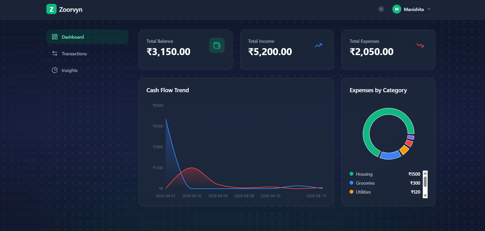
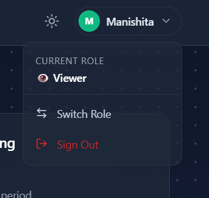
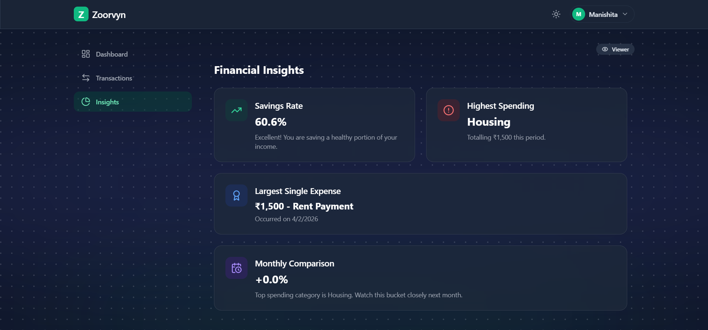

<div align="center">

<h1>
  
</h1>

<p><strong>A modern, production-ready financial dashboard — built for the Zorvyn Frontend Intern Assignment.</strong></p>

<p>
  
  
  
  
  
</p>

</div>

---

## TL;DR

> A **glassmorphism-styled financial dashboard** with dark/light mode, role-based access control, interactive charts, and real data processing — not just a pretty UI.

**What makes this stand out:**

- 🧠 **Real logic** — `map`, `filter`, `sort`, and `reduce` pipelines process transactions into charts, insights, and trends
- ♻️ **Reusable components** — `StatCard`, `GlassCard`, and `EmptyState` are generic, prop-driven, and shared across features
- 🔒 **Client-side RBAC** — Admin/Viewer toggle gates all mutations via Context, demonstrating clean access control patterns
- 📊 **Derived analytics** — savings rate, month-over-month trends, top spending category — all memoized and recomputed on data change
- 💾 **Persistent state** — transactions, theme, and role survive page reloads via `localStorage`

---

## Screenshots

### Dashboard — Dark Mode


### Dashboard — Light Mode
.png)

### Transactions & Dropdown Filter


### Transactions View


### Insights Panel


---

## Core Features

| Feature | Description |
|---|---|
| **Dashboard Overview** | Gradient summary cards (`StatCard`) with trend badges, semantic color coding, and responsive grid layout. |
| **Charts (Recharts)** | `Line`: Cumulative balance over time. `Pie`: Expense category breakdown with custom scrollable legend. |
| **Transaction Management** | Search, filter (`All/Income/Expense` + category), sort (`date/amount`), result count badge, and admin-only CRUD. |
| **Role-Based UI (RBAC)** | Toggle between `Viewer` (read-only) and `Admin`. Admin can add/edit/delete; Viewer can explore data safely. |
| **Insights Engine** | Computes top spending category, monthly comparison, savings rate, and generates human-readable insight sentences. |
| **Toasts / Snackbar** | Global feedback on key actions (`Transaction added/updated/deleted`, role changes, theme toggles). |
| **Persistence** | Transactions, theme, and role are synced to `localStorage` — experience persists across reloads. |
| **Dark / Light Mode** | Fully themed UI with smooth transitions and OS-preference detection on first visit. |
| **Motion & UX Polish** | Framer Motion tab transitions, staggered insight cards, modal animations, and toast micro-interactions. |
| **Responsive Design** | Mobile (stacked cards, horizontal nav) → tablet (2-column grid) → desktop (sidebar + 3-column layout). |

---

## Tech Stack

```
React 19          → UI framework (via Vite for fast HMR)
Tailwind CSS      → Utility-first styling with custom design tokens
Recharts          → Data visualization (line and donut charts)
Framer Motion     → Page transitions & micro-animations
Lucide React      → Icon library
Sora (Google Font)→ Modern typography matching Zorvyn branding
React Context API → Global state management (4 domain contexts)
localStorage      → Client-side data persistence
```

---

## Architecture & Data Logic

This project goes beyond UI layout — it implements **real data-processing pipelines** using standard JavaScript array methods:

### Data Pipeline (in `src/utils/transactionHelpers.js`)

| Function | Operations Used | Purpose |
|---|---|---|
| `computeSummary()` | `reduce` | Single-pass aggregation of income, expense, and net balance |
| `groupByCategory()` | `filter` → `reduce` → `map` → `sort` | Expense-only grouping for pie chart data |
| `buildTimeline()` | `reduce` → `sort` → `reduce` → `map` | Chronological cumulative balance for line chart |
| `computeTrends()` | `reduce` → `sort` | Month-over-month % change for trend badges |
| `getLargestExpense()` | `filter` → `sort` | Identify the single highest expense transaction |

### Derived State

All analytics are computed using `useMemo` — recalculated **only** when the transaction array changes. No redundant state, no stale data.

### Context Architecture

```
ThemeProvider       → Dark/light mode + localStorage sync
  └─ RoleProvider   → Admin/Viewer role + mutation guards
      └─ ToastProvider → Global notification queue
          └─ TransactionProvider → CRUD ops + localStorage persistence
```

Order matters: `TransactionContext` depends on both `ToastContext` (for feedback) and `RoleContext` (for RBAC guards).

---

## Reusable Components

These are **generic, prop-driven components** shared across multiple features — not one-off page sections:

| Component | Props | Used In |
|---|---|---|
| `StatCard` | `title`, `amount`, `icon`, `variant` (`primary`/`success`/`danger`), `trend`, `trendLabel`, `invertTrend` | Dashboard (3 summary cards) |
| `GlassCard` | `children`, `className`, `hover`, `as` | Dashboard, Transactions, Insights (10+ instances) |
| `EmptyState` | `icon`, `title`, `description`, `action` | Dashboard, Transactions, Insights (zero-data states) |

Example — rendering a stat card is a single line:

```jsx
<StatCard title="Total Balance" amount={3200} icon={Wallet} variant="primary" trend={12.5} />
```

---

## Getting Started

**Prerequisites:** Node.js (v16+) and npm

```bash
# 1. Clone the repository
git clone https://github.com/imanishita/zoorvyn-dashboard.git

# 2. Navigate into the project
cd zoorvyn-dashboard

# 3. Install dependencies
npm install

# 4. Start the development server
npm run dev
```

Open [http://localhost:5173](http://localhost:5173) in your browser.

---

## Project Structure

```
src/
├── components/           # Reusable UI primitives
│   ├── StatCard.jsx      # Metric card with trend badge (3 variants)
│   ├── GlassCard.jsx     # Frosted-glass container wrapper
│   ├── EmptyState.jsx    # Zero-data placeholder with icon + CTA
│   ├── Layout.jsx        # App shell — navbar, sidebar, toast
│   └── AnimatedBackground.jsx
├── context/              # Global state providers
│   ├── ThemeContext.jsx   # Dark/light mode + localStorage
│   ├── RoleContext.jsx    # Admin/Viewer RBAC
│   ├── ToastContext.jsx   # Global notification queue
│   └── TransactionContext.jsx  # CRUD + persistence
├── data/
│   └── mockData.js       # Seed transactions + category config
├── features/
│   ├── dashboard/        # Summary cards + charts
│   ├── transactions/     # Search/filter/sort table + modal CRUD
│   └── insights/         # Derived financial analytics
└── utils/
    ├── cn.js             # Tailwind class merge (clsx + twMerge)
    ├── formatCurrency.js # ₹ formatter with Indian numbering
    ├── roleUi.js         # RBAC constants + helpers
    └── transactionHelpers.js  # Pure data-processing functions
```

The project uses a **feature-based architecture** — each domain (dashboard, transactions, insights) is self-contained. Shared logic lives in `utils/`, shared UI in `components/`.

---

## Design Decisions

**Glassmorphism + Zorvyn Blue Accent**
The blue accent palette (`#3b82f6`) is drawn directly from [zorvyn.io](https://www.zorvyn.io/) to align the dashboard with Zorvyn's brand identity. Deep navy backgrounds (`#020617`) provide strong contrast and a professional fintech aesthetic.

**Context API over Redux**
React Context + custom hooks (`useTransactions`, `useRole`, `useTheme`) provides clean, boilerplate-free state management that is perfectly scoped for this application. Redux would be overkill and add unnecessary complexity.

**Pure Utility Functions for Data Logic**
Transaction computations live in `transactionHelpers.js` — pure functions with no side effects. This makes them independently testable, reusable, and clearly demonstrates data-processing skills beyond UI layout.

**Framer Motion for Premium Feel**
Subtle route transitions, staggered card entries, and modal animations make the app feel thoughtfully crafted. The animations are intentionally restrained — they enhance, not distract.

**RBAC without a Backend**
The Admin/Viewer toggle simulates real-world RBAC patterns entirely on the client side, demonstrating how access control logic can be cleanly decoupled from UI components using Context.

**Responsive-First Layout**
The sidebar switches between horizontal tabs (mobile/tablet) and a vertical sidebar (desktop) via Tailwind's `lg:` breakpoint, giving cards maximum room at every viewport size.

---

## Impact & Key Learnings

### What I Built

A complete, polished financial dashboard that goes past layout into **real frontend engineering** — data pipelines, state architecture, role-based access, and derived analytics.

### Technical Skills Demonstrated

- **State management** — 4 domain-specific Context providers with clear dependency ordering
- **Data processing** — `reduce`, `filter`, `sort`, and `map` chains for chart data, trends, and insights
- **Component design** — Generic, prop-driven components (`StatCard`, `GlassCard`, `EmptyState`) reused across features
- **Performance** — `useMemo` for all derived computations; no unnecessary re-renders
- **UX attention** — Empty states, loading feedback, toast notifications, keyboard-accessible focus rings
- **Persistence** — `localStorage` sync for transactions, theme, and role without a backend

### What I'd Improve Next

- Add unit tests for `transactionHelpers.js` with Jest
- Implement a budget-setting feature with progress bars
- Add CSV export for transaction data
- Deploy to Vercel with CI/CD pipeline

---

## License

This project was built as part of a frontend internship assignment. Feel free to explore the code.

---

<div align="center">
  <sub>Built with care by <strong>Manishita</strong></sub>
</div>
