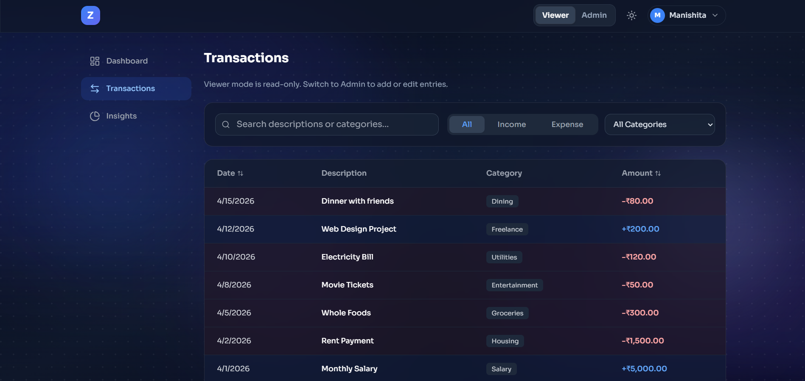

<div align="center">

<h1>
  
</h1>

<p><strong>A modern, production-ready financial dashboard — built for the Zorvyn Frontend Intern Assignment.</strong></p>

<p>
  
  
  
  
  
</p>

</div>

---

## Screenshots

### Dashboard — Dark Mode


### Dashboard — Light Mode
.png)

### Transactions & Dropdown Filter


### Insights Panel


### Transactions View


---

## Overview

Zorvyn Dashboard is a single-page financial management application that combines clean architecture with premium UI/UX. It demonstrates real-world frontend engineering patterns — role-based UI, dynamic charts, local persistence, reusable context-driven state, and polished micro-interactions — packaged in a glassmorphism interface with full dark/light mode support and a Zorvyn-branded blue accent.

---

## Features

| Feature | Description |
|---|---|
| **Dashboard Overview** | Gradient summary cards with visual hierarchy (Balance emphasized), semantic color coding, and responsive layout with hover states. |
| **Charts (Recharts)** | `Line`: Balance over time (cumulative trend). `Pie`: Expense category breakdown with custom scrollable legend. |
| **Transactions Management** | Search, filter (`All/Income/Expense` + category), sort (`date/amount`), highlighted rows, and admin-only edit/delete actions. |
| **Role-Based UI (RBAC)** | Toggle between `Viewer` (read-only) and `Admin` modes. Admin can add/edit/delete; Viewer can explore data safely. |
| **Insights Engine** | Computes top spending category, monthly comparison (%), savings rate, and a human-readable insight sentence. |
| **Toasts / Snackbar** | Global feedback on key actions (`Transaction added/updated/deleted`, role changes, theme toggles). |
| **Persistence** | Transactions, theme, and role are synced to `localStorage` so the experience persists across reloads. |
| **Dark / Light Mode** | Fully themed UI with smooth transitions and persistent user preference. |
| **Motion & UX Polish** | Framer Motion transitions for tab content, dropdowns, modals, and toast animations. |
| **Responsive Design** | Adapts from mobile (stacked cards, horizontal nav) → tablet (2-column grid) → desktop (sidebar + 3-column layout). |

---

## Tech Stack

```
React 19          → UI framework (via Vite for fast HMR)
Tailwind CSS      → Utility-first styling
Recharts          → Data visualization (line and donut charts)
Framer Motion     → Page transitions & micro-animations
Lucide React      → Icon library
Sora (Google Font)→ Modern typography matching Zorvyn branding
React Context API → Global state management
localStorage      → Client-side data persistence
```

---

## Getting Started

**Prerequisites:** Node.js (v16+) and npm

```bash
# 1. Clone the repository
git clone https://github.com/imanishita/zoorvyn-dashboard.git

# 2. Navigate into the project
cd zoorvyn-dashboard

# 3. Install dependencies
npm install

# 4. Start the development server
npm run dev
```

Open [http://localhost:5173](http://localhost:5173) in your browser.

---

## Project Structure

```
src/
├── components/       # Reusable shell UI (Layout, AnimatedBackground, Cursor)
├── context/          # ThemeContext, RoleContext, TransactionContext, ToastContext
├── data/             # mockData.js — bootstrap seed data
├── features/
│   ├── dashboard/    # Summary cards + charts
│   ├── transactions/ # Search/filter/sort table + modal CRUD
│   └── insights/     # Derived financial insights
└── utils/            # Helper utilities (cn class merge, roleUi)
```

The project uses a **feature-based architecture** — each domain (dashboard, transactions, insights) is self-contained. Adding a new financial module is as simple as creating a new folder under `features/`.

---

## Design Decisions

**Glassmorphism + Zorvyn Blue Accent**
The blue accent palette (`#3b82f6`) is drawn directly from [zorvyn.io](https://www.zorvyn.io/) to align the dashboard with Zorvyn's brand identity. Deep navy backgrounds (`#020617`) provide strong contrast and a professional fintech aesthetic.

**Context API over Redux**
React Context + custom hooks (`useTransactions`, `useRole`, `useTheme`) provides clean, boilerplate-free state management that is perfectly scoped for this application. Redux would be overkill and add unnecessary complexity.

**Framer Motion for Premium Feel**
Subtle route transitions and modal animations make the app feel thoughtfully crafted. The animations are intentionally restrained — they enhance, not distract.

**RBAC without a Backend**
The Admin/Viewer toggle simulates real-world RBAC patterns entirely on the client side, demonstrating how access control logic can be cleanly decoupled from UI components using Context.

**Responsive-First Layout**
The sidebar switches between horizontal tabs (mobile/tablet) and a vertical sidebar (desktop) via Tailwind's `lg:` breakpoint, giving cards maximum room at every viewport size.

---

## Interview Quick Notes

Use these short points if asked to explain the project quickly:

- **Architecture:** Feature-based React app with Context API split by domain (`theme`, `role`, `transactions`, `toast`).
- **State strategy:** `TransactionContext` is the source of truth; derived analytics are memoized with `useMemo`.
- **RBAC behavior:** `Viewer` is read-only; `Admin` unlocks add/edit/delete UI actions.
- **Charts:** Recharts line chart shows cumulative balance trend; pie chart shows expense distribution by category.
- **UX details:** Motion transitions, glass cards, role badge, semantic colors, action toasts, empty states.
- **Persistence:** `localStorage` keeps transactions/theme/role across refreshes with no backend dependency.
- **Responsiveness:** Mobile-first grid with `sm:grid-cols-2` → `lg:grid-cols-3`, sidebar at `lg:` only.

---

## License

This project was built as part of a frontend internship assignment. Feel free to explore the code.

---

<div align="center">
  <sub>Built with care by <strong>Manishita</strong></sub>
</div>